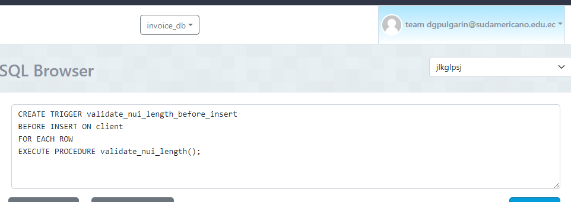

# Sentencias SQL y Capturas

## 1. Crear un función y un trigger para validar que el numero de cedula del cliente tenga 10 números (no letras) en la tabla cliente:
### Sentencia
`CREATE OR REPLACE FUNCTION validate_nui_length()`  
`RETURNS TRIGGER AS $$ `  
`BEGIN`  
  `IF LENGTH(NEW.nui) != 10 THEN`  
    `RAISE EXCEPTION 'El campo nui debe tener exactamente 10 caracteres.';`    
  `END IF;`    
  `RETURN NEW;`  
`END;`    
`$$ LANGUAGE plpgsql;`   

## 2. Crear un función y un trigger para que cada vez que se inserte un nuevo registro en la tabla item se disminuya el stock de la tabla product:
### Sentencia
`CREATE OR REPLACE FUNCTION decrease_stock()`  
`RETURNS TRIGGER AS $$`  
`BEGIN`  
    `UPDATE product`  
    `SET stock = stock - NEW.quantity`  
    `WHERE id = NEW.product_id;`  
    `IF (SELECT stock FROM product WHERE id = NEW.product_id) < 0 THEN`  
    `RAISE EXCEPTION 'Stock insuficiente.';`  
    `END IF;`  
    `RETURN NEW;`  
`END;`  
`$$ LANGUAGE plpgsql;`  

## 3. Crear un función y un trigger para la tabla invoice donde valide que el campo create_at sea del año actual (fecha sistema):
### Sentencia
`CREATE OR REPLACE FUNCTION validate_create_at()`  
`RETURNS TRIGGER AS $$`  
`BEGIN`  
    `IF EXTRACT(YEAR FROM NEW.create_at) != EXTRACT(YEAR FROM CURRENT_DATE) THEN`  
    `RAISE EXCEPTION 'La fecha create_at debe ser del año actual.';`  
    `END IF;`  
    `RETURN NEW;`  
`END;`  
`$$ LANGUAGE plpgsql;`  

## 4. Crear un función y un trigger para la tabla client y validar que el correo tenga un @:
### Sentencia
`CREATE OR REPLACE FUNCTION validate_email()`   
`RETURNS TRIGGER AS $$`  
`BEGIN`  
    `IF NEW.email !~* '^[^@\s]+@[^@\s]+\.[^@\s]+$' THEN`  
    `RAISE EXCEPTION 'Correo electrónico inválido.';`  
    `END IF;`  
    `RETURN NEW;`  
`END;`  
`$$ LANGUAGE plpgsql;`  

